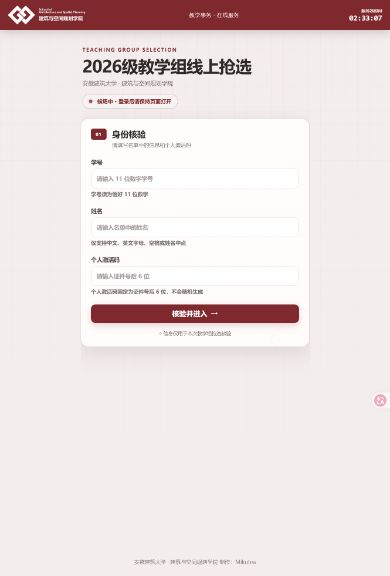
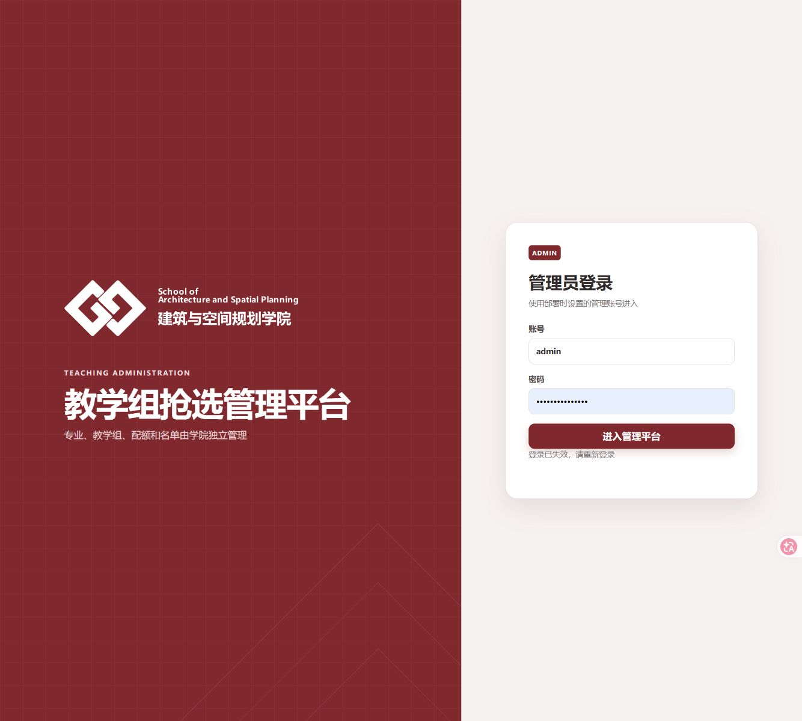

# 教学组线上抢选系统

面向学院集中教学组分配场景的一体化 Web 系统：学生手机扫码候场，教师通过实时大屏统一发令，服务端在并发事务中裁定名额，并为成功结果生成可核验的手机凭证。

**无需安装 App · 服务端统一倒计时 · 原子名额判定 · 防伪结果凭证 · WPS 友好导出**

[在线入口](https://class.miyuo.net/) · [部署手册](docs/deployment.md) · [并发架构](docs/architecture.md) · [安全说明](SECURITY.md)

> [!IMPORTANT]
> 公开仓库只包含程序、文档与不含业务数据的界面截图，不包含真实学生名单、证件号、激活码、运行数据库、管理员凭据或服务器密钥。请勿将生产数据提交到 Git。

## 项目要解决什么问题

传统的教学组分配容易同时遇到“学生进场状态不透明、开抢时间不统一、最后一席超卖、结果截图可篡改、名单和结果整理耗时”等问题。本系统把完整流程收拢到同一套服务端规则中：

- 学生使用学号、姓名和个人激活码完成身份核验，无需安装客户端；
- 候场、10 秒倒计时、开放与关闭均以服务端时间和活动状态为准；
- 名额由 SQLite 原子事务最终裁定，不以浏览器显示的剩余数为准；
- 教师可在电脑或手机管理，实时大屏连续展示候场、未选与选择流水；
- 成功学生获得 9:16 PNG 抢选结果凭证，可扫码回到服务器核验；
- 名单、未选名单和完整结果可直接导出为适配 WPS / Excel 打印的工作簿。

## 当前界面

下图采自当前生产界面。为保护隐私，只展示不含学生名单、激活码和真实选择结果的入口页面。

<table>
  <tr>
    <td width="40%" align="center">
       
      <strong>学生端</strong> 
      手机自适应 · 服务器时钟 · 身份核验
    </td>
    <td width="60%" align="center">
       
      <strong>管理端</strong> 
      学院品牌界面 · 桌面与手机响应式布局
    </td>
  </tr>
</table>

## 一次完整抢选如何运行

~~~mermaid
flowchart LR
    A[配置专业、教学组与配额] --> B[批量导入权威名单]
    B --> C[学生扫码并核验身份]
    C --> D[进入候场并持续心跳]
    D --> E[教师启动统一 10 秒倒计时]
    E --> F[服务端到点开放抢选]
    F --> G[事务队列原子判定名额]
    G --> H[生成 9:16 防伪结果凭证]
    H --> I[关闭、导出与归档]
~~~

活动生命周期固定为：

<code>关闭配置 / 学生候场 → 教师发令 → 10 秒倒计时 → 开放抢选 → 关闭 → 导出或归档并新建</code>

系统一次只维护一个“当前活动”，旧标签页、旧确认框和跨活动重复请求会被活动版本校验拒绝，避免误改下一场数据。

## 功能全景

### 学生端

| 能力 | 说明 |
| --- | --- |
| 身份核验 | 学号固定 11 位数字；姓名支持中文、英文字母、空格和姓名中点；个人激活码取规范化证件号末 6 位。 |
| 服务器时间 | 页面右上角持续显示服务端同步时间；开抢资格以服务端时钟为准。 |
| 实时候场 | 登录后自动进入候场并发送节流心跳，断线、恢复和会话失效均有明确反馈。 |
| 统一倒计时 | 所有已登录学生接收同一绝对开抢时间，本机动画只负责展示，不参与名额判定。 |
| 教学组选择 | 展示教学组容量、专业配额和剩余情况；提交前二次确认，同组重复提交可幂等恢复结果。 |
| 结果凭证 | 生成 1080 × 1920 PNG，包含版本化签名、短核验码和同源二维码，不包含证件号或激活码。 |
| 生成进度保护 | 凭证生成过程显示排队、二维码、绘制和编码进度；未生成或未下载时阻止误退出。 |
| 在线核验 | 扫描凭证二维码可直接核对服务器记录；选择被撤销后原凭证立即判为失效。 |

### 管理端与实时大屏

| 能力 | 说明 |
| --- | --- |
| 专业与教学组 | 支持新增、停用、搜索和名称自动保存；教学组容量修改会在已选人数下限上自动重算配额。 |
| 配额工作台 | “专业 × 教学组”矩阵支持筛选、批量设值、Excel 多行多列粘贴、Tab 横移和 Enter 下移。 |
| 名单导入 | 一次选择多个 CSV / XLS / XLSX；新专业在同一事务中自动创建，任一步失败整批回滚。 |
| 实时大屏 | 展示候场进度、扫码二维码、连续滚动名单、总体完成率、教学组状态和实时选择流水。 |
| 抢选控制 | 开放就绪检查、强制全屏倒计时、开放 / 关闭、未到学生确认、撤销与管理员补位。 |
| 手机管理 | 管理界面按设备尺寸自适应，可用于实时大屏控制和激活码快速查询。 |
| 多设备会话 | 同一管理员可同时使用电脑投屏和手机管理；单设备退出不影响其他设备，改密会撤销其他会话。 |
| 活动归档 | 旧活动连同结构、名单、结果和审计封存为带 SHA-256 校验的只读归档，再创建下一场。 |
| Excel 导出 | 选择记录、未选名单和本场完整结果统一居中、自动列宽、分页和打印设置，兼容 WPS / Excel。 |

## 名单导入规则

每个文件只读取第一个工作表；同一次上传的全部文件会先合并，再以一个事务导入。推荐直接使用管理端提供的 CSV 模板。

| 必填列 | 规则 |
| --- | --- |
| <code>证件号</code> | 仅在导入请求内存中用于派生末 6 位激活码；超过 15 位的 Excel 单元格必须设为文本。 |
| <code>姓名</code> | 中文、英文字母、空格或姓名中点。 |
| <code>专业名称</code> | 也兼容表头“专业”；不存在的专业会自动创建并补齐零配额。 |
| <code>学号</code> | 恰好 11 位数字；必须按文本处理，避免前导零或科学计数法破坏。 |

- CSV 编码支持 UTF-8 与 GB18030；Excel 支持 <code>.xls</code> 和 <code>.xlsx</code>。
- “合并更新”保留本批文件之外的学生；“同步名单”把本次所有文件并集视为权威全集，并停用遗漏学生。
- 同文件或跨文件学号重复、字段校验失败、配额或状态冲突都会使整批回滚。
- 系统不随机生成、批量重置或单独补发激活码；证件信息变化时应重新导入权威名单。

## 并发与名额一致性

~~~mermaid
sequenceDiagram
    participant S as 学生浏览器
    participant A as FastAPI
    participant Q as 有界写入队列
    participant D as SQLite

    S->>A: 提交教学组 + CSRF + 活动版本
    A->>A: 验签、学生级与来源级限流
    A->>Q: 按到达顺序进入关键写队列
    Q->>D: BEGIN IMMEDIATE + 独立 savepoint
    D->>D: 校验会话、活动、重复选择、专业配额、总容量
    alt 尚有名额
        D-->>Q: 写入选择与审计并提交
        Q-->>S: 返回结果与签名凭证
    else 已满或状态冲突
        D-->>Q: 回滚该请求的 savepoint
        Q-->>S: 返回明确冲突或受控重试提示
    end
~~~

关键保证：

- 同一学生只能存在一条有效选择，数据库唯一索引是最终防线；
- 数据库触发器同时阻止专业配额和教学组总容量超限；
- 同批请求共享一次提交，但每个请求拥有独立 savepoint，单个失败不会污染其他请求；
- 选择请求可驱逐尚未执行的低优先级登录 / 心跳写入，队列拥塞时返回受控错误而不是超卖；
- 成功响应丢失后，同一学生重放同组选择可恢复原结果和原凭证，不会产生第二条记录；
- 当前采用单应用副本 + SQLite 权威账本，不用 Redis 承担名额双写。

> [!NOTE]
> 当前产品定位是单学院、单场约 150 人。仓库并发回归覆盖“150 人争 30 席”和“300 人同时成功提交”等原子性场景；这不等于已经认证 1000 人真实外网全链路容量。若扩展到 1000 人、多活动并行或多应用副本，应重新压测登录、心跳、倒计时、提交和凭证下载，并优先评估 PostgreSQL。

## 系统架构

~~~mermaid
flowchart TB
    subgraph Client[客户端]
        Student[学生手机端]
        Admin[教师管理端]
        Board[全屏实时大屏]
        Verify[凭证核验页]
    end

    Student --> HTTPS[Cloudflare Tunnel / HTTPS]
    Admin --> HTTPS
    Board --> HTTPS
    Verify --> HTTPS
    HTTPS --> Origin[127.0.0.1:80]

    subgraph VM[独立应用虚拟机]
        Origin --> Container[只读 Docker 容器 FastAPI + Uvicorn]
        Container --> Queue[有界批量写队列]
        Queue --> DB[(本机 SQLite 数据卷)]
        DB --> Backup[在线备份与发布回滚副本]
    end
~~~

- 前端使用原生 HTML / CSS / JavaScript，无需单独的 Node 构建链；
- API 与静态资源由 FastAPI 同源提供，减少跨域和部署复杂度；
- Docker 容器使用非 root 用户、只读根文件系统、<code>cap_drop: ALL</code> 与 <code>no-new-privileges</code>；
- 源站默认只绑定 <code>127.0.0.1</code>，公网流量通过同机 Cloudflare Tunnel 的出站连接进入；
- SQLite 数据卷必须位于虚拟机本机磁盘，不应直接放在 SMB / NFS 上；
- 更新器只接受完整 40 位提交号，并在维护窗前后执行备份、schema、完整性、健康和公网检查。

## 隐私与安全设计

| 边界 | 实现 |
| --- | --- |
| 完整证件号 | 只在名单导入请求内存中短暂处理，不写数据库、响应、审计、归档或应用日志。 |
| 学生激活码 | 登录使用基于 <code>APP_SECRET</code> 的 HMAC；管理员按需查看使用 AES-GCM 加密副本，60 秒后自动隐藏并记录审计。 |
| 管理员密码 | 仅保存 PBKDF2-SHA256（600,000 次）不可逆哈希；服务器不保存明文初始密码。 |
| 会话与请求 | <code>HttpOnly</code>、<code>SameSite=Strict</code> Cookie，生产 HTTPS 启用 <code>Secure</code>；写操作校验 CSRF 和当前活动版本。 |
| 结果凭证 | 服务端签名 Token 与短核验码；Token 放在 URL fragment，不进入初始请求或 Referer。 |
| 审计与导出 | 关键管理操作写审计；电子表格单元格中和公式前缀，避免导出后触发公式注入。 |
| 供应链 | Docker 基础镜像固定 digest；CI 对生产与开发依赖运行固定版本的 <code>pip-audit</code>。 |

安全问题请按 [SECURITY.md](SECURITY.md) 私密报告，不要在公开 Issue 粘贴名单、学号、激活码、日志原文、数据库或管理员凭据。

## 快速开始

### 方式一：Docker Compose（推荐）

环境要求：Docker Engine 与 Docker Compose v2。

~~~powershell
git clone https://github.com/mikutea/ahjzu-teaching-group-choice.git
Set-Location ahjzu-teaching-group-choice
Copy-Item .env.example .env
python -c "import secrets; print(secrets.token_urlsafe(48))"
~~~

编辑 <code>.env</code>，至少替换以下项目：

~~~dotenv
ENVIRONMENT=development
DATA_DIR=/data
ORIGIN_BIND=127.0.0.1
APP_SECRET=粘贴刚生成的至少32字符随机值
ADMIN_USERNAME=admin
ADMIN_INITIAL_PASSWORD=设置一个仅用于首次初始化的强密码
PUBLIC_BASE_URL=http://127.0.0.1
COOKIE_SECURE=false
APP_VERSION=local
~~~

启动并检查：

~~~powershell
docker compose up --build -d
docker compose ps
Invoke-WebRequest http://127.0.0.1/api/health
~~~

- 学生端：<http://127.0.0.1/>
- 管理端：<http://127.0.0.1/admin>

首次数据库初始化成功后，请立即把 <code>.env</code> 中的 <code>ADMIN_INITIAL_PASSWORD</code> 清空。后续管理员密码只能通过管理端修改，服务器不会保存可恢复的明文密码。

### 方式二：直接运行 Python

环境要求：Python 3.12。将 <code>.env</code> 中的 <code>DATA_DIR</code> 改为本机可写目录（例如 <code>./data</code>），并把 <code>PUBLIC_BASE_URL</code> 改为 <code>http://127.0.0.1:8765</code>。

~~~powershell
python -m venv .venv
.\.venv\Scripts\Activate.ps1
python -m pip install --upgrade pip
python -m pip install -r server/requirements-dev.txt
uvicorn server.main:create_app --factory --host 127.0.0.1 --port 8765 --env-file .env
~~~

## 主要环境变量

| 变量 | 用途 | 建议 |
| --- | --- | --- |
| <code>APP_SECRET</code> | 会话签名、激活码 HMAC / 加密等根密钥 | 必填，至少 32 字符；生产环境随机且唯一。 |
| <code>ADMIN_INITIAL_PASSWORD</code> | 仅在空数据库首次创建管理员 | 首次启动后立即清空，不得提交。 |
| <code>PUBLIC_BASE_URL</code> | 学生二维码与凭证核验基础地址 | 生产环境必须使用正式 HTTPS 域名。 |
| <code>COOKIE_SECURE</code> | 是否仅通过 HTTPS 发送 Cookie | 生产环境设为 <code>true</code>。 |
| <code>DATA_DIR</code> | SQLite、备份及运行数据目录 | 必须位于本机持久磁盘。 |
| <code>TRUSTED_PROXY_IPS</code> | 可信反向代理地址 | 仅填写实际代理，避免伪造来源地址。 |
| <code>APP_CPU_LIMIT</code> / <code>APP_MEMORY_LIMIT</code> | Compose 容器资源上限 | 默认 1.5 CPU / 1 GiB；变更后重新压测。 |
| <code>APP_NOFILE_LIMIT</code> | 容器文件描述符上限 | 默认 8192。 |
| <code>SQLITE_WRITE_BATCH_SIZE</code> | 单批写请求数量 | 默认 64，范围由程序约束。 |
| <code>SQLITE_WRITE_QUEUE_LIMIT</code> | 有界写入队列容量 | 默认 4096。 |
| <code>SQLITE_WRITE_BATCH_WINDOW_MS</code> | 短批量聚合窗口 | 默认 4 ms。 |

完整部署、Cloudflare Tunnel、更新、备份与恢复步骤见 [docs/deployment.md](docs/deployment.md)。生产环境不要直接照搬开发配置。

## 测试与质量门禁

~~~powershell
python -m pytest --basetemp "$env:LOCALAPPDATA\Codex\teaching-choice-tests\manual-run"
python -m pip_audit -r server/requirements.txt
python -m pip_audit -r server/requirements-dev.txt
~~~

自动化测试在临时目录中动态构造虚构名单，不在仓库中保留 CSV、XLS、XLSX、数据库或旧格式测试样例。CI 覆盖身份核验、活动隔离、候场、倒计时、重复提交、末位并发、防超卖、名单事务、凭证核验、WPS 导出和权限边界。

## 运维速查

~~~powershell
# 查看服务状态
docker compose ps

# 查看最近日志
docker compose logs --tail=200 app

# 在容器内执行数据库与业务一致性检查
docker compose exec app python -m server.maintenance check
~~~

正式升级必须指向经过审查的完整 40 位 Git 提交号，并使用部署文档中的单入口更新脚本；不要在生产服务器上直接修改源码、数据库或容器内文件。

## 仓库结构

~~~text
.
├─ assets/brand/           学院品牌素材（不属于 MIT 授权范围）
├─ deploy/                 首次部署、Cloudflare Tunnel、备份与更新脚本
├─ design/                 README 使用的当前真实界面截图
├─ docs/                   需求、并发架构与独立虚拟机部署文档
├─ server/                 FastAPI、SQLite、名单解析、导出、安全与维护逻辑
├─ tests/                  运行时生成虚构数据的回归与并发测试
├─ web/                    学生端、管理端、实时大屏和凭证核验前端
├─ Dockerfile
├─ docker-compose.yml
└─ README.md
~~~

## 参与开发

提交改动前请阅读 [CONTRIBUTING.md](CONTRIBUTING.md)。所有变更应通过测试、依赖审计和当前 PR 审查；不要使用真实名单做测试，也不要把 <code>.env</code>、数据库、导出文件或临时截图加入仓库。

## 品牌与许可

程序代码以 [MIT License](LICENSE) 发布。学院标识及学校、学院名称不在 MIT 授权范围内，详见 [NOTICE.md](NOTICE.md)。

页面固定版权信息：<code>安徽建筑大学 · 建筑与空间规划学院 制作：Mikutea</code>
