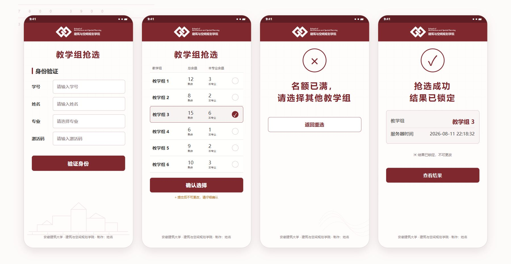
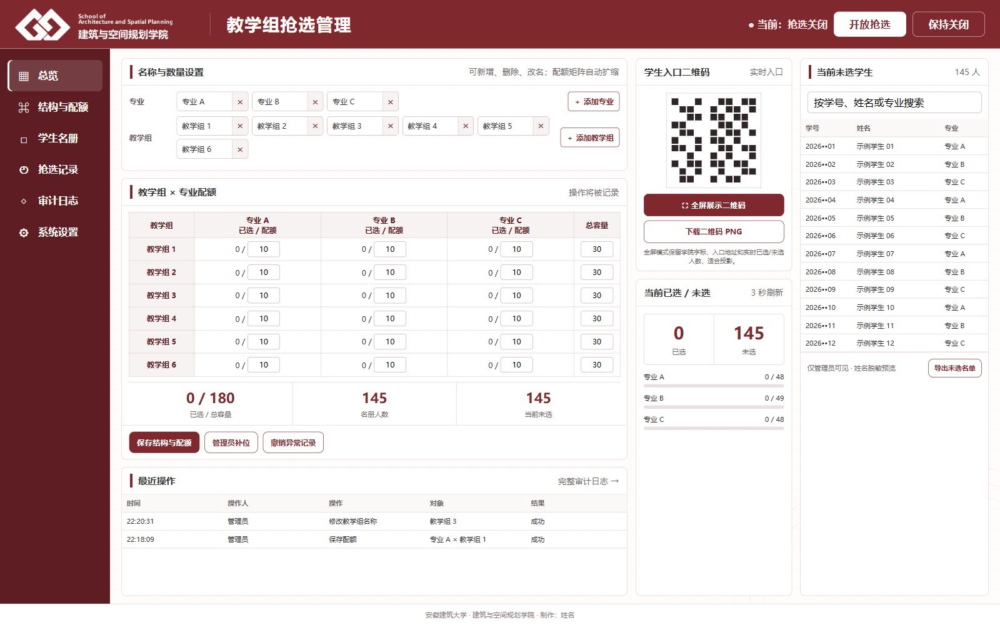

# 建筑与空间规划学院教学组抢选系统

面向手机扫码使用的网页抢选工具。学生无需安装 App，扫码并完成身份核验后先进入候场；教师在实时大屏发起统一 10 秒倒计时，倒计时结束后所有学生按同一服务端时间进入教学组抢选。管理端可维护专业、教学组名称及数量，并实时查看候场、未到、已选和未选情况。

> 当前状态：响应式学生端、管理端、动态专业/教学组、配额事务、名单导入导出、Docker 部署及独立虚拟机实机验收均已完成。

## 定稿界面

### 学生端



### 管理端



管理端设计包含：

- 专业名称和数量可增减；
- 教学组名称和数量可增减；
- 各专业 × 各教学组配额矩阵；
- 可全屏放大的学生端二维码；
- 候场已进入/未进入实时统计与自动分页名单；
- 教师发令、统一 10 秒倒计时和到点开抢；
- 已选/未选实时统计；
- 未选学生名单侧栏与教学组进度自动轮播；
- 抢选开放/关闭、补位、撤销与导出入口。

## 业务边界

- 每位学生只能保留一个教学组选择，最终结果由服务端数据库判定。
- 最后一席采用数据库事务处理，避免多人同时提交导致超额。
- 自由抢选只能保证上限，不能自动保证每组最低人数；截止后由管理员按规则补位。
- 公开仓库仅含演示数据。真实学生名单、激活码与数据库必须留在部署服务器。

## 技术路线

- 响应式网页：手机学生端 + 桌面管理端；
- Python API + SQLite 原子事务，已纳入 150 人同时抢 30 席的防超卖回归；
- 候场心跳按学生节流写入，实时投屏读取不会改变名额账本；
- 激活码登录使用不可逆 HMAC；为满足管理员按需查看，另存 AES-GCM 认证加密副本，查看行为限流并写入审计；
- 支持多届、多学期连续使用：旧活动带 SHA-256 校验归档，新活动可复制原结构；
- Docker Compose 部署到独立 Proxmox 虚拟机；
- 源站端口默认只绑定 `127.0.0.1`，由同机 Cloudflare Tunnel 提供公网 HTTPS；
- 提供带备份副本迁移演练、健康等待与失败恢复的单入口更新脚本，发布目标必须是完整 40 位提交号；
- 审计日志、CSV 导入导出、备份完整性检查与受控恢复流程；
- CI 使用固定版本的 `pip-audit` 审计生产和开发依赖；
- 自动化测试覆盖身份核验、重复提交、末位并发和权限边界。

## 本地运行

```powershell
Copy-Item .env.example .env
# 将 .env 中的 APP_SECRET、ADMIN_INITIAL_PASSWORD 和 PUBLIC_BASE_URL 改为本机测试值
python -m pip install -r server/requirements-dev.txt
uvicorn server.main:create_app --factory --host 127.0.0.1 --port 8765
```

- 学生端：<http://127.0.0.1:8765/>
- 管理端：<http://127.0.0.1:8765/admin>

运行测试：

```powershell
python -m pytest --basetemp "$env:LOCALAPPDATA\Codex\teaching-choice-tests\manual-run"
```

批量验收可使用 [180 人虚构学生名单](examples/fictional-students-180.csv)；数据边界见
[示例数据说明](examples/README.md)。该名单不含激活码，导入后由系统随机生成并一次性展示给管理员下载。

独立虚拟机部署见 [docs/deployment.md](docs/deployment.md)。
并发、Redis 取舍和多活动归档设计见 [docs/architecture.md](docs/architecture.md)。

## 品牌与许可

代码以 [MIT License](LICENSE) 发布。学院标识及学校、学院名称不在 MIT 授权范围内，详见 [NOTICE.md](NOTICE.md)。

页面页脚版权信息固定为：`安徽建筑大学 · 建筑与空间规划学院 制作：Mikutea`，管理端和 API 均不提供修改入口。
