

# 管理端操作说明

**活动准备 · 候场确认 · 统一倒计时 · 实时大屏 · 教师手机凭据核验 · 结果导出**

适用角色：学院授权管理教师　｜　推荐主控：1920 × 1080 阶梯教室投影　｜　辅助：手机管理端

> [!IMPORTANT]
> **演示数据声明：**本说明所有截图来自隔离环境，姓名、学号、激活码、专业配额、选择结果和时间均为虚构数据。图片带有固定水印，不包含生产数据库或真实学生信息。

> [!WARNING]
> 倒计时、开放/关闭抢选、撤销选择、管理员补位、同步名单、归档和新建活动都会改变业务状态。正式操作前必须确认当前活动标题、活动状态和名单范围；不要在生产服务器上直接修改数据库。

## 建议的职责与设备安排

| 角色 | 建议设备 | 主要任务 |
| --- | --- | --- |
| 主控教师 | 电脑连接 16:9 教室投影或大屏 | 登录、准备检查、倒计时、开放/关闭、观察实时大屏 |
| 辅助教师 | 手机管理端与手机相机 | 随时查看全屏实时大屏、查询激活码，并扫描核验学生凭据 |
| 结果复核 | 电脑 | 撤销/补位、导出选择记录和完整结果、留存归档 |

同一管理员可以在电脑和手机同时登录。单个设备“安全退出”不会让其他设备退出；修改管理员密码会撤销其他会话，正式活动中不要临时改密。

## 一、登录管理平台

打开正式管理地址的 `/admin`，输入部署时设置的管理员账号和当前密码，点击 **“进入管理平台”**。

图 1　阶梯教室投影分辨率下的管理端登录页；正式环境应使用 HTTPS，浏览器地址必须与学院公布地址一致。

登录后先确认右上方活动标题与状态。不要使用共享账号密码截图、聊天转发或浏览器明文保存；首次初始化后应清空服务器环境变量中的初始明文密码。

## 二、正式活动前检查清单

建议至少提前 30 分钟完成：

- [ ] 活动标题、学院名称和学生端正式 HTTPS 地址正确。
- [ ] 专业、教学组名称和总容量正确。
- [ ] “专业 × 教学组配额矩阵”每列总配额不超过教学组总容量。
- [ ] 权威名单已导入，学生总数、专业人数与原始名单一致。
- [ ] 抽查至少 3 名学生的学号、姓名、专业与激活码查询。
- [ ] 电脑、投影/大屏、手机和至少两种网络均能打开学生端。
- [ ] 实时大屏二维码可被手机扫码，域名不是 `127.0.0.1` 或内网测试地址。
- [ ] 浏览器保持唤醒，关闭自动更新、屏保、通知弹窗和省电休眠。
- [ ] 已完成数据库备份与完整性检查。

管理端的“开放就绪检查”会显示阻断项和提醒。存在阻断项时不要开抢；HTTP、测试域名等提醒在生产环境也必须消除。

## 三、配置专业、教学组与配额

进入 **“专业与教学组”**：

1. 在“专业设置”中新增、搜索、改名或停用专业。
2. 在“教学组设置”中新增教学组并设置总容量。
3. 名称和容量输入完成后会自动保存，不需要逐行点击多个“已保存”按钮。
4. 使用筛选框快速缩小列表；开放抢选后结构会锁定，避免中途改变规则。
5. 在配额矩阵中设置各专业分配到各教学组的数量。

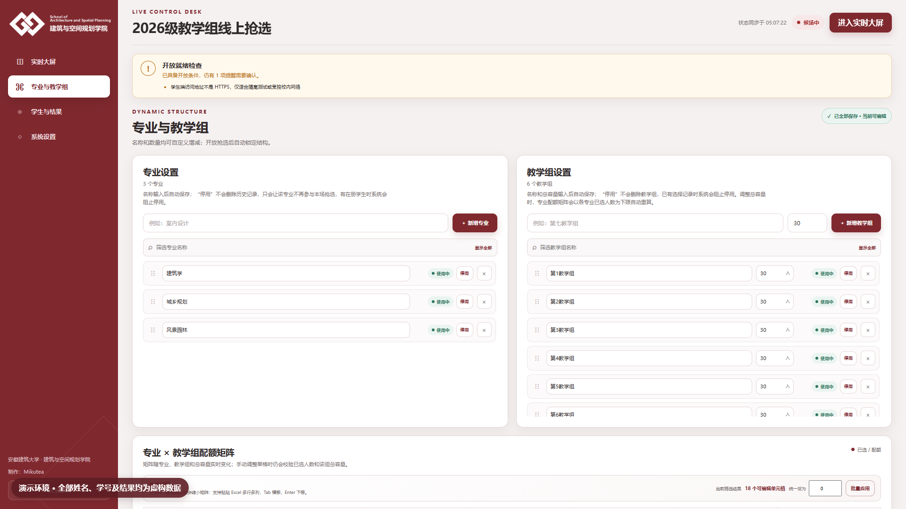

图 2　专业、教学组和配额矩阵在同一 1920 × 1080 工作区中完成；截图数据均为虚构。

### 配额矩阵的高效操作

- 上方专业和教学组搜索框会同步缩小矩阵。
- “统一设为”可批量设置当前筛选范围内的可编辑单元格。
- 支持从 Excel 粘贴多行多列；`Tab` 横向移动，`Enter` 纵向移动。
- 调整教学组总容量时，系统会以各专业已选人数为下限自动重算。
- 已有选择后不能把配额调到低于已选人数，也不能超过教学组总容量。

## 四、导入学生名单

进入 **“学生与结果”**，在“导入学生名单”中选择一个或多个 CSV / XLS / XLSX 文件。

图 3　导入、处理模式和补位功能集中在同一页面；不应使用真实名单制作公开截图。

### 文件要求

| 列名 | 要求 |
| --- | --- |
| 学号 | 恰好 11 位数字；Excel 中按文本保存，避免科学计数法或丢失前导零 |
| 姓名 | 与权威名单一致；支持中文、英文字母、空格和姓名中点 |
| 专业 / 专业名称 | 名单中出现但系统不存在的专业会自动创建并补齐零配额 |
| 证件号 | 仅用于派生末 6 位激活码；长数字必须按文本保存 |

### 两种处理方式

- **合并更新：**更新本批文件中的学生，并保留文件外学生；适合分批补充。
- **同步名单：**把本次选择的全部文件并集视为权威全集，停用遗漏学生；只在完整名单确认无误后使用。

同次上传会先整体校验，再在一个事务内写入。任意文件、任意行失败都会整批回滚；看到错误时应修改源文件后重新导入，不要在数据库中手工修补。

## 五、查询个人激活码

“本场完整学生名单”默认显示全部学生，可按姓名、学号或专业快速搜索。激活码默认显示为 `••••••`，点击 **“显示明文”** 后短暂展示，60 秒后自动隐藏并记录审计。

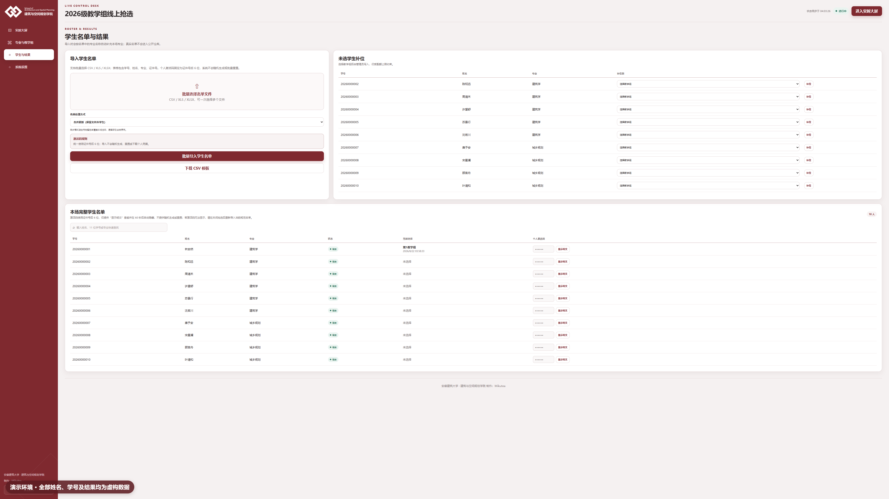

图 4　激活码默认遮罩；只向本人核验，不在群聊、投影或截图中公开。

查询时先让学生提供姓名与学号，再当面核对。不要批量展示、抄录或导出激活码；若无法显示，应在关闭抢选后重新导入当前规范名单。

## 六、组织学生进入候场

返回 **“实时大屏”**，让学生扫描二维码并完成身份核验。候场页会同时显示：

- 已进入与尚未进入人数；
- 候场完成率和进度条；
- 实时进入候场流水；
- 按专业展示并连续滚动的尚未进入名单。

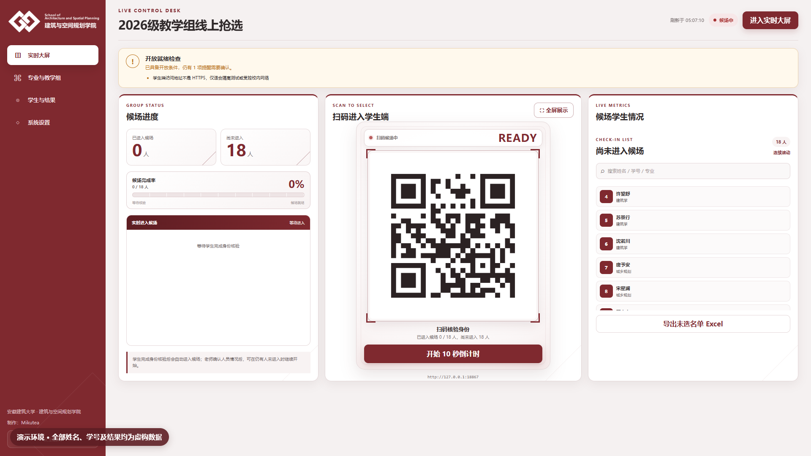

图 5　主控教师根据实时名单核对到场情况；二维码和人数每秒自动同步。

建议等大多数学生进入后再开始。对于迟到、请假或无法登录的学生，先确认学院现场规则，不要因为单个设备异常临时改变配额。

## 七、启动统一 10 秒倒计时

点击 **“开始 10 秒倒计时”**。若仍有学生未进入，系统会弹出确认窗口，按专业分组显示姓名与人数。

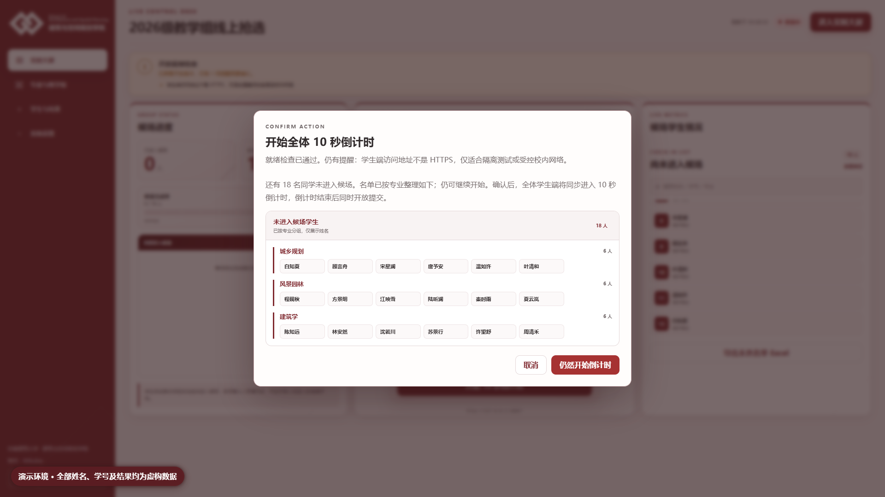

图 6　先核对尚未进入名单；确认按既定规则继续时，再点击“仍然开始倒计时”。

确认后，所有管理端会强制进入实时大屏展示倒计时，倒计时动画不会嵌在普通管理后台中。不要在倒计时期间刷新、切换活动或关闭浏览器。

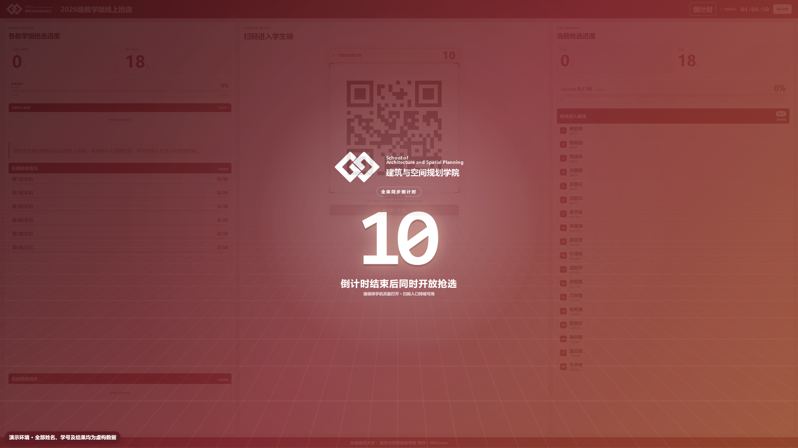

图 7　完整进入动画后的 1920 × 1080 全屏倒计时；开放时刻由服务器保存的绝对时间决定。

## 八、开放期间监控实时大屏

倒计时归零后系统自动开放。普通管理页集中显示教学组名额、选择流水、二维码、已选/未选人数、总体完成率和未选名单。

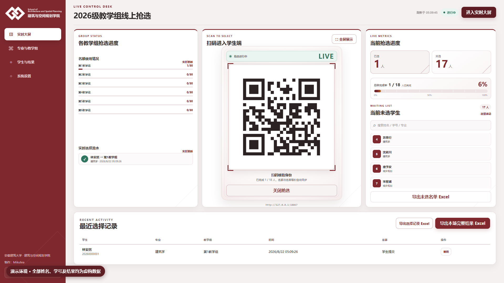

图 8　进行中管理面板用于主控操作和最近选择记录核对。

点击 **“进入实时大屏”** 或 **“全屏展示”** 后，可投放到教室屏幕。列表采用连续滚动方式展示，二维码位于中间主视觉区域。

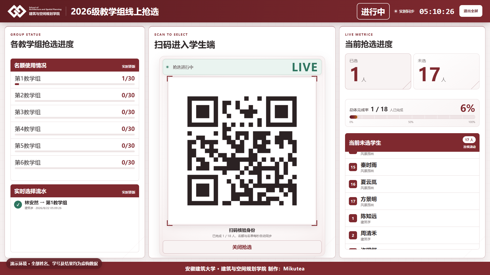

图 9　阶梯教室全屏实时大屏：左侧教学组与选择流水，中间二维码，右侧总体进度和未选学生。

### 开放期间重点观察

1. 总体完成率是否持续增长。
2. 各教学组已用/总容量是否符合预期。
3. 实时选择流水是否持续更新。
4. 未选学生是否因网络问题长期不变。
5. 是否出现大量受控重试、登录失败或凭证生成失败反馈。

系统由服务端事务最终裁定名额；不要根据某一台浏览器瞬时显示手工判断最后一席。

## 九、关闭抢选、补位与撤销

达到学院规定结束条件后，点击二维码下方 **“关闭抢选”**。关闭后：

- 学生不能再提交新选择；
- 管理员可在“学生与结果”中为未选学生补位，仍受专业配额和总容量约束；
- 已有错误结果可使用“撤销”，原凭证会立即核验失效；
- 撤销和补位均应先核对学生、教学组与学院审批依据，并保留审计记录。

不要为了修改单个学生而重新开放整场抢选。优先使用补位/撤销的受控流程。

## 十、教师手机核验抢选结果凭据

这是**管理端教师使用手机完成的核验操作**，不是学生端操作，也不在电脑管理后台表格中核验。学生下载的“抢选结果凭据”包含防伪二维码和短核验编号；需要复核时，由教师手机扫描二维码并读取服务器原始记录，不能只看学生提供的截图文字或卡片样式。

1. 请学生打开已下载的原始凭据图片，不要使用聊天软件压缩后无法识别的缩略图。
2. 用负责管理工作的教师手机相机或可信扫码工具扫描凭据右下角二维码；核验页会在手机浏览器中临时打开。
3. 等待核验页面显示 **“核验有效”**，再逐项核对活动、姓名、脱敏学号、专业、教学组、系统记录时间和核验编号。
4. 若显示 **“已撤销”**，说明原选择已被管理员撤销，不能继续作为当前结果使用。
5. 若显示 **“无效”**，应让学生重新打开原始凭据；仍无效时以管理端导出记录为准并检查审计日志。
6. 若显示网络错误或请求过于频繁，保持原页面，稍候点击 **“重新核验”**；不要据此直接判断凭据真伪。

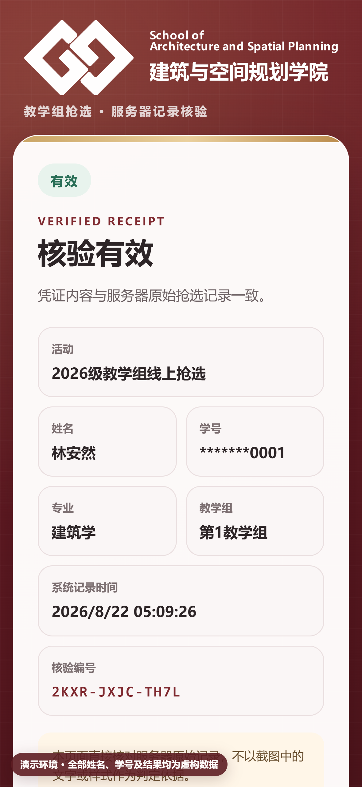

图 10　管理教师手机上的核验页；“核验有效”表示凭据内容与服务器原始抢选记录一致，截图中的姓名、学号、结果和编号均为虚构。

> [!IMPORTANT]
> 核验页只保留必要的脱敏学号，并在读取后从地址栏移除凭据令牌。请勿复制、转发二维码链接，也不要把核验页面作为新的学生凭据长期保存。

## 十一、导出与打印

管理端提供：

- **导出选择记录 Excel：**记录学生、专业、教学组、时间、来源和状态。
- **导出未选名单 Excel：**用于后续补位和提醒。
- **导出本场完整结果 Excel：**包含全体学生的最终状态。

工作簿已统一设置自动列宽、水平/垂直居中、表头样式、分页和打印区域，下载后可直接使用 WPS 或 Excel 检查并打印。打印前仍需确认：活动标题、总人数、已选/未选统计和每组人数与管理端一致。

## 十二、手机管理端

手机管理端常驻导航只保留两项高频功能：**实时大屏控制**和**激活码查询**，界面按 iPhone 15 Pro 竖屏自适应，不需要横向滚动。凭据核验由教师手机相机扫描学生凭据二维码后打开独立核验页，不新增第三个常驻菜单。

<table>
  <tr>
    <td width="33%" align="center">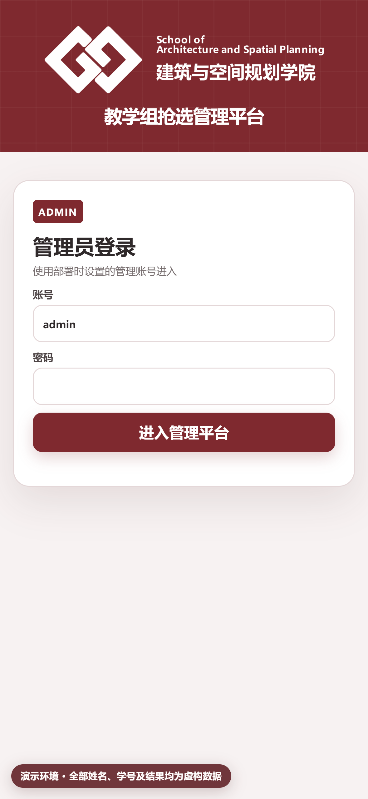 手机登录</td>
    <td width="33%" align="center">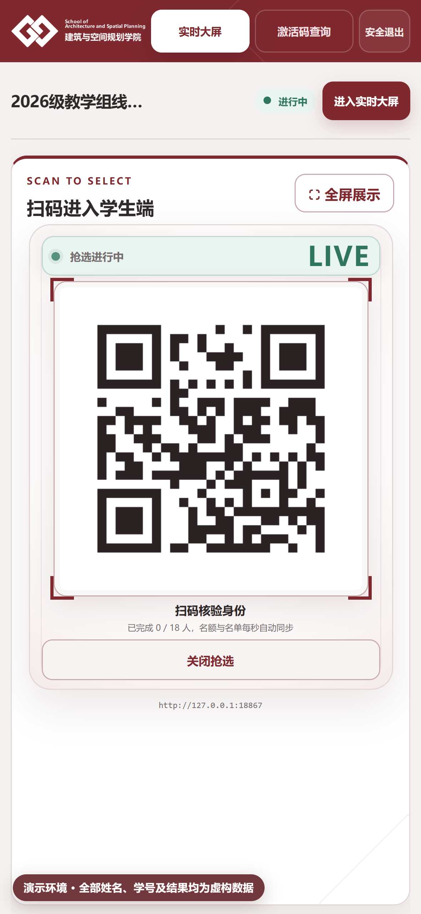 实时大屏与抢选开关</td>
    <td width="33%" align="center">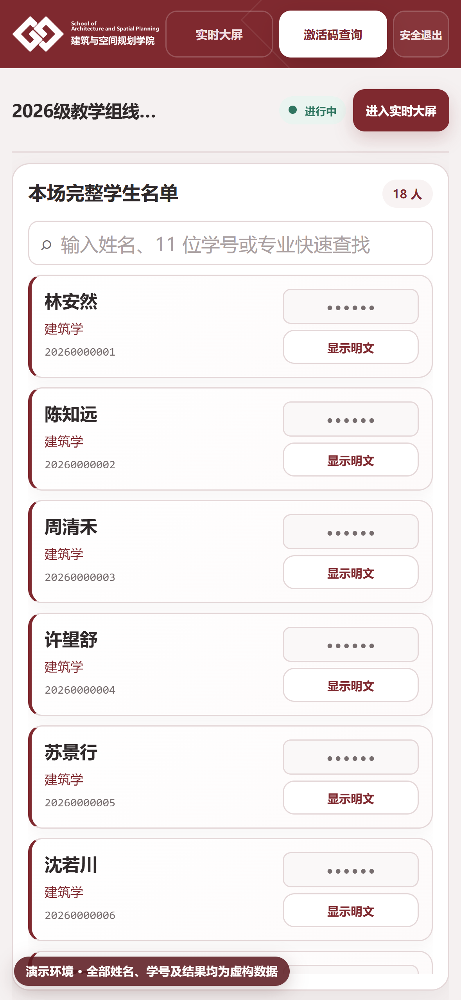 默认全名单与快速搜索</td>
  </tr>
</table>

手机可作为辅助主控，但正式倒计时和开关操作仍建议由现场指定的一名教师负责，避免电脑和手机同时重复操作。

## 十三、异常处置速查

| 现象 | 立即动作 | 后续判断 |
| --- | --- | --- |
| 二维码无法打开 | 检查正式域名、HTTPS、Cloudflare 与源站健康 | 不要把 `127.0.0.1` 或内网地址投给学生 |
| 多名学生无法登录 | 暂停倒计时，检查名单导入、时钟、网络与限流 | 抽查不同专业和不同网络的学生 |
| 候场人数不更新 | 保持管理页打开，检查学生页面是否休眠及服务端连接 | 不以口头报数替代管理端记录 |
| 倒计时未展示 | 不手工宣布开抢，检查当前活动状态与所有管理端是否进入大屏 | 必要时关闭本场并按既定应急方案重来 |
| 提交峰值响应变慢 | 不刷新服务器、不重启容器；让学生保持页面等待 | 观察受控排队与错误率，确认无超卖 |
| 某组名额异常 | 立即关闭抢选并导出当前记录 | 完整性检查后再决定撤销或补位 |
| 凭证生成缓慢 | 选择已成功的学生保持页面等待进度 100% | 不让学生重复提交，检查静态资源和服务日志 |
| 凭据扫码核验无效 | 重新扫描学生保存的原始图片，核对活动与核验编号 | 查看该选择是否已撤销；最终以服务器导出和审计日志为准 |
| 管理端会话失效 | 使用另一已登录管理设备保持现场控制 | 重新登录前确认不会重复触发倒计时或关闭 |

## 十四、结束后的标准流程

1. 关闭抢选并确认状态为“已关闭”。
2. 导出选择记录、未选名单和完整结果。
3. 对照管理端统计复核总人数和各教学组人数。
4. 完成审批所需的撤销或补位，并重新导出最终版本。
5. 执行数据库完整性检查与备份。
6. 确认无需再改本场后，再归档并新建下一场活动。
7. 安全保存结果文件，按学院数据管理制度限制访问和保留期限。

---

返回 [操作手册目录](README.md) · 查看 [学生端操作说明](student-guide.md) · 查看 [部署手册](../deployment.md)
