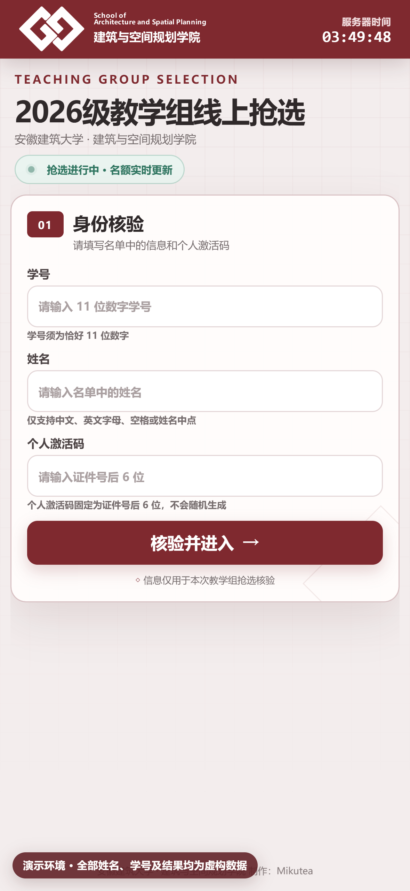
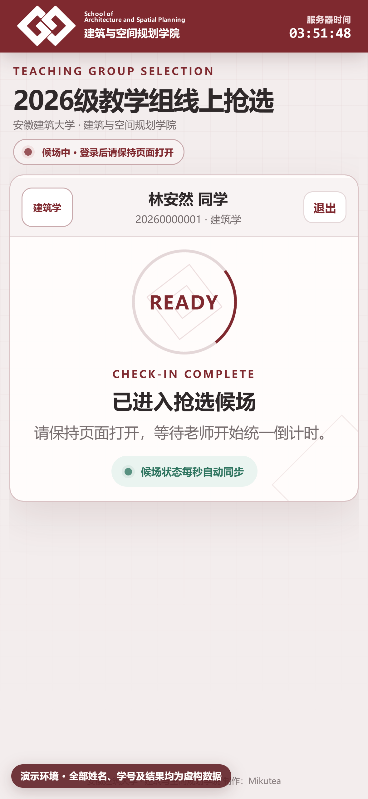
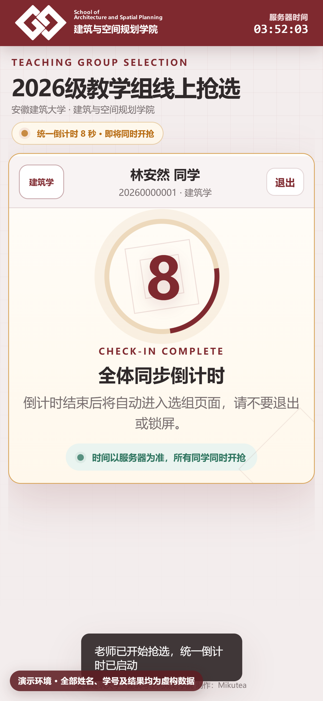
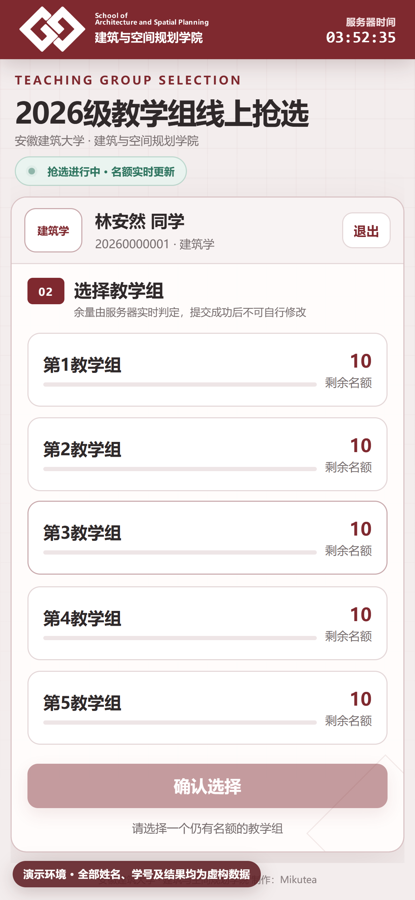
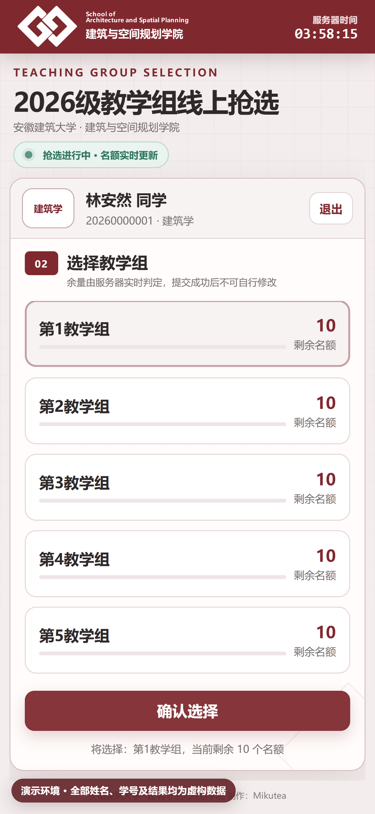
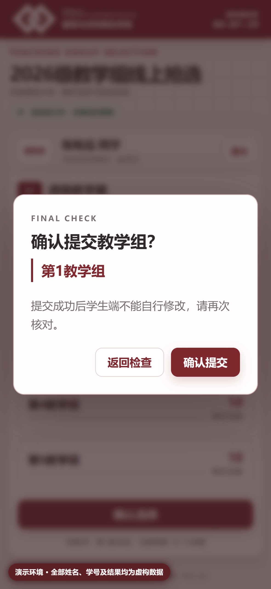
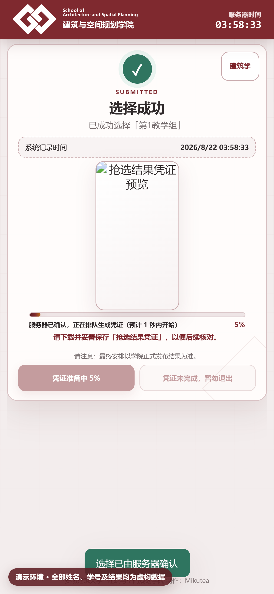
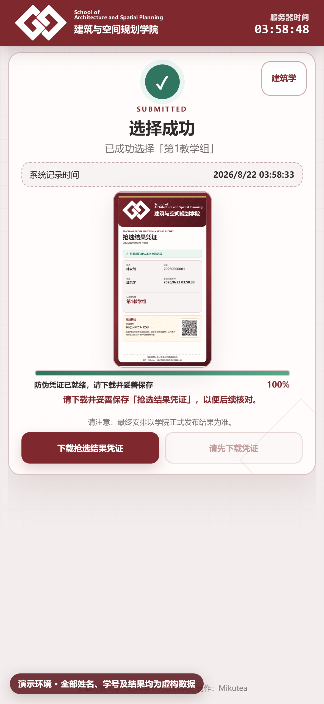

# 学生端操作说明

**身份核验 · 实时候场 · 统一倒计时 · 抢选结果凭证**

适用设备：手机浏览器　｜　建议网络：稳定的校园网、Wi-Fi 或移动网络

> [!IMPORTANT]
> **演示数据声明：**本说明中的姓名、学号、激活码、选择结果和时间均为虚构数据，仅用于演示操作。截图来自隔离环境，不包含真实学生信息；每张截图均带有虚构数据水印。

> [!TIP]
> 最稳妥的操作顺序是：提前登录并保持候场页打开 → 等待统一倒计时 → 选择教学组 → 二次核对 → 等凭证进度达到 100% → 下载并确认已保存后再退出。

## 一页看懂完整流程

| 阶段 | 你要做什么 | 完成标志 |
| --- | --- | --- |
| 1. 身份核验 | 输入 11 位学号、名单姓名和个人激活码 | 页面显示自己的姓名、学号和专业 |
| 2. 进入候场 | 保持页面打开，不锁屏、不退出 | 页面出现 `READY` 与“已进入抢选候场” |
| 3. 统一倒计时 | 不刷新页面，等待倒计时归零 | 自动进入教学组选择页 |
| 4. 选择教学组 | 查看剩余名额，点选一个教学组 | 被选卡片高亮，“确认选择”按钮可用 |
| 5. 二次确认 | 再次核对教学组名称并确认提交 | 页面显示“选择成功” |
| 6. 保存凭证 | 等进度达到 100%，下载图片并检查相册或文件 | 已保存完整的 9:16 抢选结果凭证 |

## 使用前准备

1. 使用微信、Safari、Chrome、Edge 等现代浏览器打开老师提供的二维码或链接。
2. 准备好名单中登记的姓名、11 位数字学号和个人激活码。
3. 个人激活码固定为证件号规范化后的末 6 位，不是随机码；如无法确认，请联系老师查询。
4. 保证手机电量和网络稳定，关闭浏览器的省电休眠限制更稳妥。
5. 不要把个人激活码、结果凭证或包含核验二维码的页面发到公开群聊。

## 第一步：身份核验

扫描实时大屏二维码或打开老师提供的学生端链接，依次填写：

- **学号：**恰好 11 位数字；不要输入空格、短横线或其他字符。
- **姓名：**必须与导入名单一致，支持中文、英文字母、空格和姓名中点。
- **个人激活码：**6 位数字或字母，字母大小写不敏感时仍建议按原样输入。

填写完成后，点击 **“核验并进入”**。

图 1　iPhone 15 Pro 学生端登录页；截图中全部身份信息均为虚构数据。

核验失败时先逐项检查格式，不要连续快速重复提交。若页面提示姓名、学号或激活码不匹配，请让老师在管理端“激活码查询”中核对，不要自行猜测。

## 第二步：保持候场

核验成功后，页面会显示自己的姓名、学号、专业，以及 `READY` 和“已进入抢选候场”。此时：

1. 保持当前标签页在前台，尽量不要切换应用或锁屏。
2. 不要重复扫码，也不要在另一台设备同时频繁登录。
3. 观察右上角服务器时间；倒计时和开放时刻以服务器为准。
4. 页面会每秒同步候场状态，短暂断网恢复后通常会自动重新同步。

图 2　出现 READY 即表示已进入候场；等待期间保持页面打开。

## 第三步：等待统一 10 秒倒计时

老师确认人员情况并开始倒计时后，所有已登录学生会看到同一个服务端倒计时。页面会自动过渡，无需手动刷新。

- 倒计时期间不要退出、后退、锁屏或刷新。
- 本机动画只负责显示，实际开放资格与名额由服务器裁定。
- 倒计时结束后会自动进入选择页面；若没有跳转，先等待数秒让网络恢复，再按故障处理表操作。

图 3　统一倒计时以服务器时间为准，所有同学同时开抢。

## 第四步：选择教学组

开放后，页面列出本专业可选教学组及当前剩余名额。

1. 先看清教学组名称和剩余名额。
2. 点击目标教学组整张卡片，不要只反复点数字。
3. 卡片高亮后，确认底部 **“确认选择”** 按钮已变为可用状态。
4. 如果某组显示无剩余名额，请立即改选其他仍有名额的教学组。

图 4　名额会实时变化，浏览器显示仅供参考，最终以服务器提交结果为准。

选中后卡片会高亮。提交前还可以返回检查或改选；一旦服务端确认成功，学生端不能自行修改。

图 5　选中状态确认无误后，再点击“确认选择”。

## 第五步：完成二次确认

系统会弹出最终确认框，明确显示即将提交的教学组。请停下来再核对一次：

- 名称正确：点击 **“确认提交”**。
- 名称不正确：点击 **“返回检查”**，重新选择。

图 6　提交成功后不能由学生自行修改，因此必须完成最后核对。

不要在提交过程中反复点击。即使网络响应较慢，也应先等待服务器返回；系统对同一学生同一教学组的重复请求会进行幂等处理，但频繁操作会增加不必要的网络压力。

## 第六步：等待结果凭证生成

出现“选择成功”说明选择已经由服务器记录，但凭证图片还需要生成。此时页面会显示进度条和当前阶段。

> [!WARNING]
> **进度未到 100% 时不要退出。**“选择已成功”和“凭证已下载”是两件事；必须等图片生成完成并下载保存。

图 7　生成期间下载按钮不可用，退出按钮也会提醒凭证尚未完成。

正常情况下会依次完成排队、二维码、卡片绘制和图片编码。若长时间停在某一百分比：

1. 保持页面打开，确认网络仍可用。
2. 等待 10～20 秒，不要重复提交教学组。
3. 若页面明确提示失败，可按页面提示重试生成。
4. 仍无法完成时，保留“选择成功”页面并立即联系老师核对后台记录。

## 第七步：下载并妥善保存凭证

进度达到 100% 后，点击 **“下载抢选结果凭证”**。凭证为 1080 × 1920 PNG，包含姓名、学号、专业、教学组、服务器记录时间、短核验码和防伪二维码，不包含完整证件号或个人激活码。

图 8　看到 100% 和可点击的下载按钮后，再保存并离开页面。

下载后请立即检查：

1. 相册、“文件”应用或浏览器下载目录中能找到图片。
2. 图片完整，顶部学院标识、本人信息、教学组与底部核验区域均清晰可见。
3. 不要裁剪、涂改、重新压缩或覆盖原图。
4. 建议同时保存到手机相册和个人文件夹，但不要上传到公开网络。
5. 最终安排仍以学院正式发布结果为准；凭证用于后续核对，不替代学院正式通知。

## 常见问题与处理

| 现象 | 可能原因 | 建议处理 |
| --- | --- | --- |
| 提示学号格式错误 | 不是恰好 11 位数字 | 删除空格或符号，重新输入完整学号 |
| 姓名或激活码不匹配 | 与导入名单不一致 | 联系老师在管理端按姓名或学号查询，不要猜测激活码 |
| 已登录但老师看不到候场 | 网络中断、页面进入后台或会话失效 | 回到页面等待自动同步；无效时退出后重新核验 |
| 倒计时结束没有进入选择页 | 网络延迟或页面被系统休眠 | 保持页面前台等待数秒；仍无变化再刷新并重新核验 |
| 点击教学组后提示已满 | 提交到达服务器时名额已用完 | 立即选择其他仍有名额的教学组 |
| 提交后响应很慢 | 峰值时请求正在有序排队 | 保持页面打开，不要连续点击或退出 |
| 已显示选择成功但没有图片 | 凭证仍在生成或资源加载失败 | 等进度到 100%；按页面提示重试生成，勿重复选组 |
| 下载后找不到图片 | 浏览器下载权限或保存位置不同 | 查看下载记录、相册和“文件”应用；必要时再次下载同一凭证 |
| 原凭证突然核验失效 | 管理员撤销了选择或活动已变更 | 联系学院确认最新正式结果 |

## 离开页面前的最后检查

- [ ] 页面明确显示“选择成功”。
- [ ] 凭证生成进度为 100%。
- [ ] 已点击“下载抢选结果凭证”。
- [ ] 已在相册或文件中打开过完整图片。
- [ ] 教学组名称和个人信息无误。
- [ ] 使用公共设备时已退出账号。

---

返回 [操作手册目录](README.md) · 查看 [管理端操作说明](admin-guide.md)
